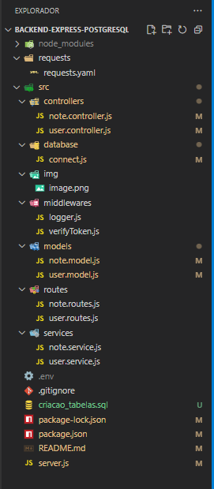

# Mini-Projeto Fullstack - Parte II  

## 🟣 CRUD de Notas Autenticado com JWT

Este projeto é a **continuação do Mini-Projeto Fullstack (Parte I)**, evoluindo a aplicação backend para incluir uma **nova funcionalidade completa de CRUD (Create, Read, Update e Delete) de Notas**, totalmente **protegida por autenticação JWT**.  

A aplicação mantém a mesma estrutura de camadas (controllers, routes, services, models, database e middlewares), garantindo boas práticas e organização do código.

---

## 🟣 Objetivo

Desenvolver uma **feature autenticada** que permita o gerenciamento de recursos de forma segura, apenas por usuários logados.  

Todas as operações CRUD são protegidas e vinculadas ao **usuário autenticado**, impedindo acesso, alteração ou exclusão de dados de outros usuários.

---

## 🟣 Tecnologias Utilizadas

- **Node.js**  
- **Express.js**  
- **MongoDB Atlas**  
- **JWT (jsonwebtoken)**  
- **Dotenv**  
- **Nodemon**  
- **Insomnia** (para testes de requisições)  
- **Vercel** (hospedagem do backend)

---

## 🟣 Estrutura de Pastas



---

## 🟣 Funcionalidades Implementadas

- ✅ **Cadastro e Login de usuários** com hash de senha e autenticação JWT  
- ✅ **CRUD completo** de anotações
- ✅ **Rotas protegidas por token JWT** (somente o usuário autenticado acessa seus próprios dados)  
- ✅ **Tratamento de erros e respostas HTTP apropriadas**  
- ✅ **Logs de ações e erros no terminal**  
- ✅ **Utilização de variáveis de ambiente com dotenv**  
- ✅ **Hospedagem funcional (Vercel)**  

---

## 🟣 Rotas da API

### Usuário
| Método | Rota | Descrição | Autenticação |
|:--:|:--|:--|:--:|
| **POST** | `/api/register` | Cadastra novo usuário | ❌ |
| **POST** | `/api/login` | Realiza login e retorna token JWT | ❌ |
| **GET** | `/api/profile` | Retorna dados do usuário autenticado | ✅ |

### Notas
| Método | Rota | Descrição | Autenticação |
|:--:|:--|:--|:--:|
| **POST** | `/api/notes` | Cria uma nova nota | ✅ |
| **GET** | `/api/notes` | Lista todas as notas do usuário | ✅ |
| **GET** | `/api/notes?title=...` | Filtra notas por título | ✅ |
| **GET** | `/api/notes/:id` | Retorna uma nota específica | ✅ |
| **PUT** | `/api/notes/:id` | Atualiza todos os dados de uma nota | ✅ |
| **PATCH** | `/api/notes/:id` | Atualiza parcialmente uma nota | ✅ |
| **DELETE** | `/api/notes/:id` | Remove uma nota do usuário autenticado | ✅ |

---

## 🟣 Variáveis de Ambiente (.env)

```env
PORT=3000
MONGO_URI=string_de_conexao_mongodb
JWT_SECRET=token_secreto
```

---

## 🟣 Testes de Requisição (Insomnia)

Foram criados dois ambientes:
- **Local:** `http://localhost:3000`
- **Produção:** (será adicionado após deploy no Vercel)

Em ambos:

Header:  ```Authorization: Bearer {{token_local}}```


A pasta `requests/` contém todas as requisições (local e produção).

--- 

## 🟣 Hospedagem e Acesso

Backend em Produção: [Projeto em Produção](https://mini-projeto-fullstack-parte2.vercel.app/)

Base URL Local: http://localhost:3000

--- 

## 🟣 Deploy (Vercel)
- Subir o projeto para o GitHub
- Importar o repositório no [Vercel](https://vercel.com/)
- Configurar variáveis de ambiente:
  - `MONGO_URI`
  - `JWT_SECRET`
  - `PORT=3000` (opcional)
- Após o deploy, o backend será acessível em: [Projeto em Produção](https://mini-projeto-fullstack-parte2.vercel.app/)

---

## 🟣 Vídeo de Demonstração

Um vídeo curto (até 2 minutos) foi gravado demonstrando:

- Execução das requisições no Insomnia (localmente e em produção);

- Visualização dos dados cadastrados no MongoDB Atlas (localmente e em produção);

- Rotas CRUD protegidas com JWT.

🔗 [Clique aqui para assistir ao vídeo de demonstração]()

---